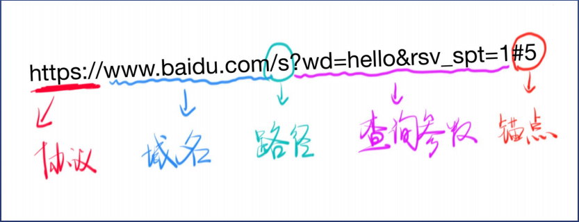
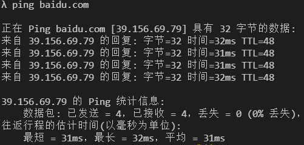

# 浅析URL

## 前言

统一资源定位符（英语：Uniform Resource Locator，缩写：URL，或称统一资源定位器、定位地址、URL地址）俗称网页地址，简称网址，是因特网上标准的资源的地址（Address），如同在网络上的门牌。它最初是由蒂姆·伯纳斯-李发明用来作为万维网的地址，现在它已经被万维网联盟编制为因特网标准RFC 1738

## URL的组成部分以及作用

URL组成部分：协议+域名或IP+端口号+路径+查询字符串+锚点

1.协议：http/https

2.域名或IP：URL中域名是指IP对应的字符串，IP用来定位设备的字符串。

3.端口号：代表了服务器中所提供的服务。

4.路径：是一个字符串，用来判定查询什么网页

5.查询字符串：通过查询字符串，可以直接定位到所需要查询内容位置。

6.锚点：内容区域已经到了，文档内部的定位；不支持中文，不会传递给服务器。  

## DNS（Domain Name System）的作用

1.客户机想DNS服务器发送域名查询请求

2.DNS服务器告知客户机web服务器的IP地址

3.客户机与web服务器通信

## nslookup命令使用方法
 
nslookup用于查询DNS的记录，查询域名解析是否正常，在网络故障时用来诊断网络问题

nslookup www.baidu.com

nslookup www.baidu.com 114.114.114.114

## IP（Internet Protocol）的作用

IP是在TCP/IP协议族中网络层的主要协议，用于分组交换数据网络。任务仅仅是根据源主机和目的主机的地址来传送数据。为此目的，IP定义了寻址方法和数据报的封装结构。

IP分为内网IP和外网IP，内网和外网无法直接访问，只有通过路由器来访问。

## Ping命令使用方法： 

## 什么是域名

域名就是IP的别称

一个域名可以对应不同的IP，这叫做均衡负载；

一个IP可以对应不同的域名，这叫做共享主机。

## 域名分类：

com(顶级域名)

xiedaimala.com （二级域名）

www.xiedaimala.com （三级域名）

